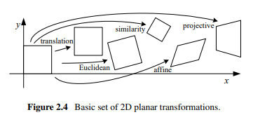
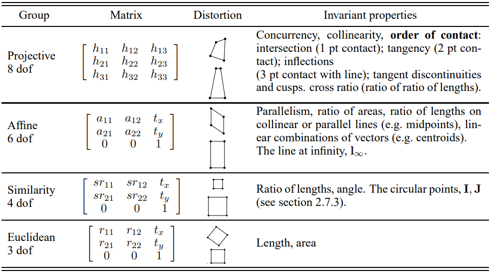

# Introduction

This is an implementation of problem 2.2 of the [Computer Vision book](https://szeliski.org/Book/)

(Image credits: [Computer Vision book](https://szeliski.org/Book/))

It implements 2D projective transformations with 8 degrees of freedom: translation (2), scale (1), rotation (1), deformation (2), rotation outside of plane along x-axis and y-axis (2)

Deformation is same as: rotation by theta -> compression / decompression along x-axis -> rotation by -1 * theta. Two degrees of freedom are theta and the amount of compression / decompression along x-axis.

2D projective transformations are obtained by specifying 8 elements of the transformation matrix that applies on the 2-d points in homogenous coordinates:

(Image credits: Multiple View Geometry in Computer Vision, Second Edition (Hartley and Zisserman 2004; Faugeras and Luong 2001))

Explaination in the computer vision book is not too detailed but one of the references it includes has more detailed explanation:

Multiple View Geometry in Computer Vision, Second Edition (Hartley and Zisserman 2004; Faugeras and Luong 2001) -> Part 0: The Background: Projective Geometry, Transformations and Estimation -> 2.4 A hierarchy of transformations

# Open questions and future work

- Implement (x and y) shearing transformation
- Optimize the code more by avoiding for loops and using numpy for most operations
- Remove artifacts from gifs during rotation, scaling, etc. by implementing some form of interpolation

# Installation and Running instructions

Installation failed for me until I ran this command in bash:

export LD_PRELOAD=/usr/lib/x86_64-linux-gnu/libstdc++.so.6

as suggested here:

https://github.com/pygame/pygame/issues/3405
